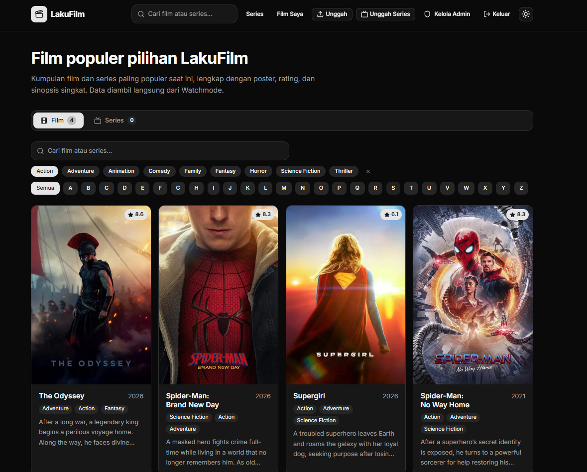

# LakuFilm — Nontren bareng, kamu hosting sendiri

> **LakuFilm** adalah platform streaming video pribadi berbasis web yang dibangun dengan *Next.js*. Kamu bisa mengunggah film & series, mengelola kualitas video (360p/720p/1080p), serta menghapus berkas asli otomatis saat data dihapus — semua berjalan **lokal tanpa database**.

---

## 📸 Screenshot

Beranda (Home) — menampilkan daftar film & series lokal di samping saran film dari sumber eksternal:



---

## ✨ Fitur Utama

- **Desain responsif modern** — didukung *Tailwind CSS* & komponen *shadcn/ui*, nyaman di desktop maupun mobile.
- **Navigasi cepat & intuitif** — *App Router* Next.js 13+ dengan navigasi *client-side* yang halus.
- **Manajemen video lengkap** — unggah film & series, dukungan multi-kualitas video, thumbnail, rating, dan genre.
- **Penghapusan berkas otomatis** — ketika sebuah film, series, atau episode dihapus, file video dan thumbnail yang bersesuaian di folder `public/uploads/` juga dihapus secara otomatis, **tanpa menghilangkan berkas yang masih dipakai entitas lain**.
- **Ringan & self-contained** — tidak memerlikan server database eksternal. Semua data disimpan dalam file JSON lokal.
- **Autentikasi pengguna** — sistem login & register sederhana dengan role-based access (admin/user), semua data tersimpan lokal.

---

## 🛠️ Teknologi yang Digunakan

| Lapisan | Teknologi |
|---|---|
| Framework | **Next.js 16** (App Router) |
| UI | **React 19** + **shadcn/ui** |
| Styling | **Tailwind CSS 4** (`tailwind-merge`, `clsx`, `cva`) |
| Data (lokal) | File **JSON** (`lib/data-video.json`, `lib/users.json`) via Node.js `fs` |
| Upload parsing | **Formidable** + *multipart form handler* |
| Ikon | **Lucide React** |
| Tema | `next-themes` (light/dark mode) |
| Pengelola paket | **pnpm** |

---

## 🚀 Instalasi & Menjalankan di Komputer Lokal

1. Pastikan [Node.js](https://nodejs.org/) (v18+ direkomendasikan) dan [pnpm](https://pnpm.io/) sudah terpasang.

2. *Clone repository* ini dan masuk ke direktori proyek:

```bash
git clone <url-repo-anda> laku-film
cd laku-film
```

3. Pasang dependensi:

```bash
pnpm install
```

4. Jalankan server pengembangan:

```bash
pnpm dev
```

5. Buka di browser: [http://localhost:3000](http://localhost:3000)

> Default akun admin: username `admin`, password `admin`. Akun dapat dikelola di `lib/users.json`.

---

## 🔧 Build untuk Produksi

```bash
pnpm build
pnpm start
```

---

## 📁 Struktur Folder

```
laku-film/
├── app/                          # App Router (Next.js 13+)
│   ├── api/                      # Route API (films, series, episodes, files)
│   │   ├── films/[id]/route.ts   # CRUD + hapus file otomatis
│   │   ├── series/[id]/route.ts  # CRUD series + hapus file otomatis
│   │   ├── series/route.ts       # Create series
│   │   └── files/route.ts        # Handler upload (multipart + JSON I/O)
│   ├── film-saya/                # Halaman "film saya" (CRUD lokal)
│   ├── login/                    # Halaman login
│   ├── register/                 # Halaman registrasi
│   ├── upload/                   # Unggah/edit film
│   ├── upload-series/            # Unggah/edit series + episode
│   ├── series/[id]/              # Detail series + daftar episode
│   ├── play/[id]/                # Pemutar video
│   └── page.tsx                  # Beranda (Home)
├── components/
│   ├── ui/                       # Komponen dasar shadcn/ui
│   ├── auth-guard.tsx            # Guard proteksi halaman
│   ├── auth-provider.tsx         # Konteks otentikasi
│   ├── home-browser.tsx          # Grid browser film/series
│   ├── movie-card.tsx            # Kartu film
│   ├── series-actions.tsx        # Aksi episode & series (edit/hapus)
│   ├── site-header.tsx           # Navigasi atas
│   └── quality-video-picker.tsx  # Pemilih berkas video per kualitas
├── lib/
│   ├── data-video.ts             # Helper baca/tulis JSON data-video
│   ├── data-video.json           # Data film & series (lokal)
│   ├── types.ts                  # Definisi tipe TypeScript
│   ├── users.json                # Data pengguna (lokal)
│   ├── video-quality.ts          # Konstanta kualitas video
│   └── watchmode.ts              # Integrasi sumber film eksternal
├── public/                       # Aset statis (uploads, ikon, placeholder)
│   └── uploads/                  # Video & thumbnail hasil unggah
├── styles/                       # Global CSS (Tailwind directives)
├── package.json
├── tsconfig.json
└── README.md
```

---

## ⚙️ Cara Kerja Penghapusan Berkas

Saat sebuah **film**, **series**, atau **episode** dihapus melalui antarmuka atau API, handler `DELETE` yang bersangkutan akan:

1. Membaca seluruh data lokal (`lib/data-video.json`).
2. Menghitung sekumpulan nama berkas yang **masih sedang dipakai** oleh entitas yang tersisa (deterministik, agar tidak ada berkas yang terhapus secara tidak sengaja karena dipakai bersama).
3. **Hanya menghapus** berkas video (`videoFileName`, tiap entry di `videoFiles`) dan thumbnail (`thumbFileName`) yang memang **tidak lagi terpakai**.
4. Memperbarui file JSON data lokal.

Logika ini diterapkan secara konsisten di:
- `app/api/films/[id]/route.ts` — `DELETE` & `PATCH`
- `app/api/series/[id]/route.ts` — `DELETE`, `PATCH` (termasuk episode yang dikeluarkan saat edit)
- `app/api/series/[id]/episodes/[episodeId]/route.ts` — `DELETE`

---

## 🤝 Berkontribusi

Kontribusi sangat diterima kasih! Silakan buat *pull request* dan jelaskan perubahan yang diajukan.

---

## 📄 Lisensi

Proyek ini bersifat **open source** dan tersedia di bawah lisensi **MIT**.
